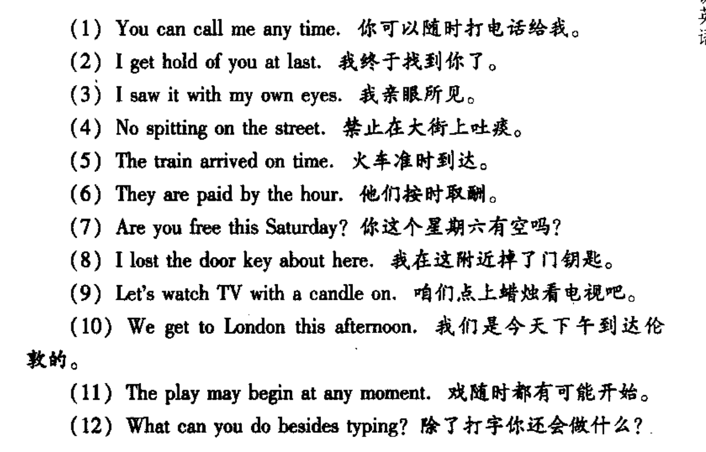

第23页

# 第五章直接了当说英语

英语先让大家看到主要事件，然后再把事件发生的事件地点、手段等次要的信息放在句子后面做个补充。

而汉语刚好相反

一些示例

看了示例，很有价值的感觉，不愧是大家之作，特别是

No spitting on the street（禁止再大街上吐痰）

吐痰在英语环境里面在最前面，但是在汉语语境里面是在最后面，这样的区别度是很高的，能够区分出不同语境里面的不同表达方式，让我们有所了解