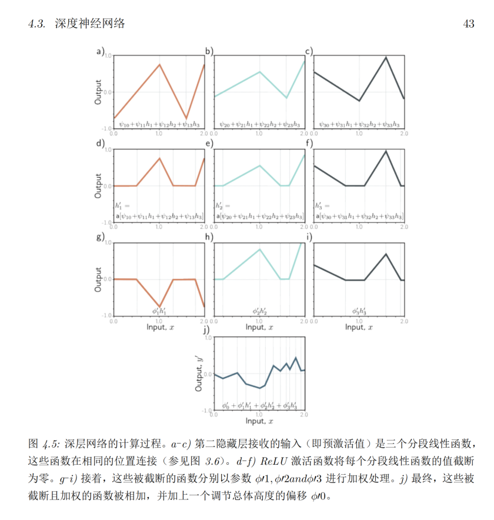
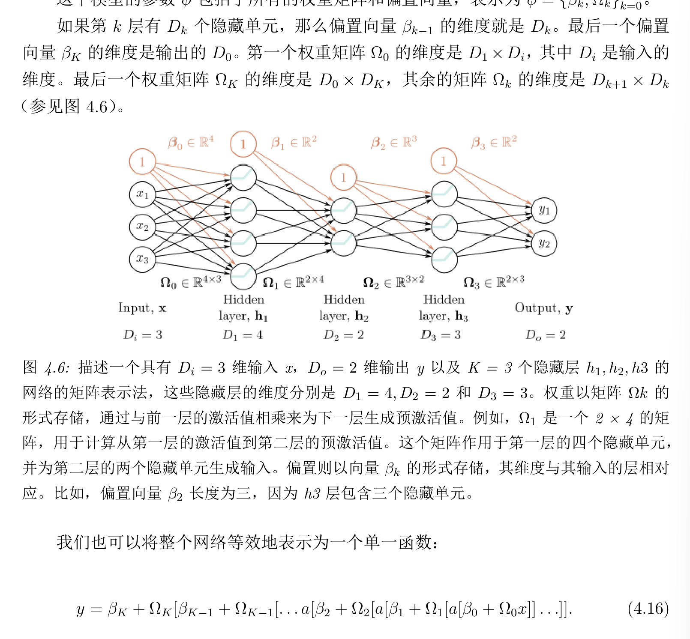

## 2026年3月11日
第44~47页

深度神经网络，就是这么一个长长的图，其实还是一样的，每一层都是使用不同的公式函数去计算，得到后续的结果内容

公式4.10，是对于深度神经网络的内部操作更加全面的视角的了解。后续需要对于公式4.10 做更深入的分析。

现在的情况，需要快速的过一遍整本书的内容，就像浅层神经网络一样，不会不理解时，再回来看，不用想着第一遍能完全理解并接受。

4.3.1 超参数

网络的“宽度”：每层隐藏单元的数量

网络的“深度”：隐藏层的数量

网络的“容量”：隐藏单元的总数量

4.4 矩阵表示法

就是把上面的各种公式，使用同一的命名规范去表示深度神经网络

这个图，就非常的好用，还是对于矩阵表示的一种数学描述，不用过多的去纠结细节，能够弄清楚其中的搞法就可以了，目前只能要求看懂，不能完全的记忆住细节情况

4.5 浅层网络与深层网络的比较

浅层可以无限的逼近一个连续函数，深层如果有一个固定层，其实就是浅层。

深度网络，会存在很多种的折叠现象，虽然可用的区间变多了，但是很多都是对称出来的，有比较大的局限性。

#### 今日总结
深度网络与浅层网络有很大的相似性，深度网络的一个特例，其实就是浅层网络。深度网络利用了很多的折叠去实现更多的计算区间。