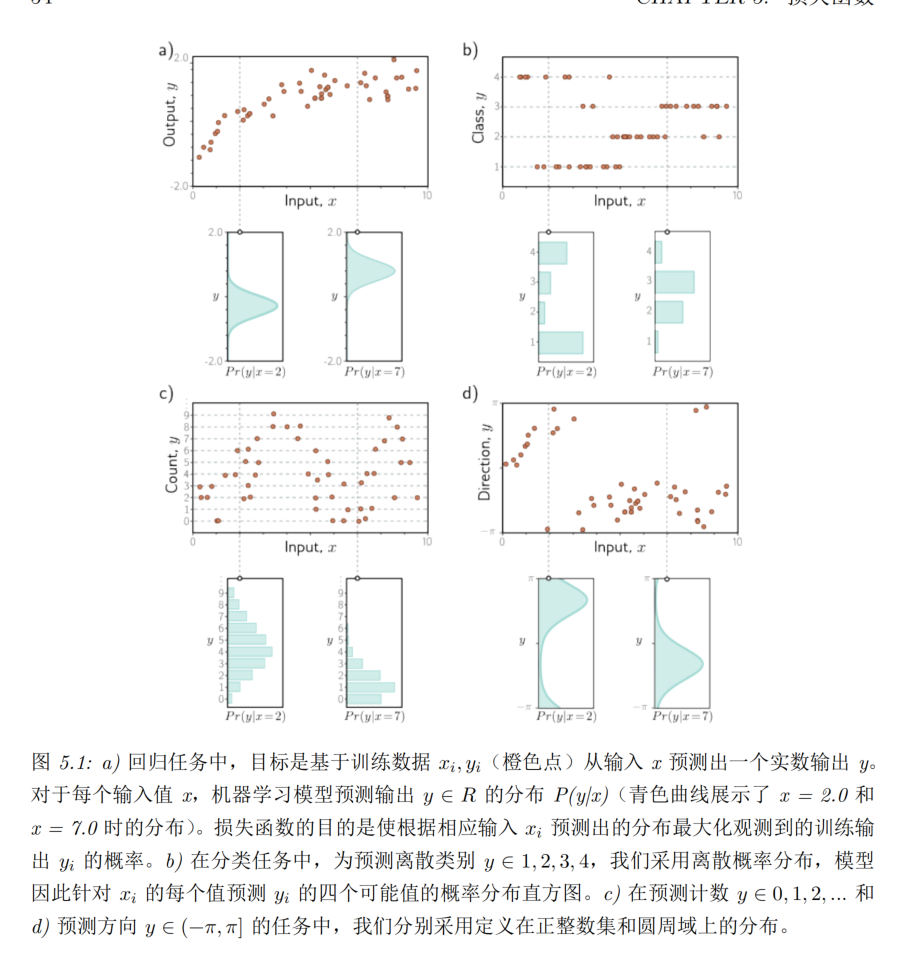

## 2026年3月12日
第48~54页

深度效率，某些需要浅层网络指数级隐层单元的逼近，深层网络很容易实现，但是目前还不确定是否真的有类似函数。

大型结构化输入，像图像这种大输入的，可以从局部到整体实现全图的学习，就必须使用深度网络实现了。

泛化和训练，深层网络更容易训练，深层网络居然还有很多概念没有被充分理解。

但是依然不能否定她的价值，虽然未知，但是可以使用她来解决问题，现实世界中有很多类似的情况都是类似的。

# 第五章 损失函数
5.1 最大似然

上来就是王炸，图5.1 很不容易理解，

简单理解：a) 两个青色曲线，其实就是对应的y所在的范围  
b) 两个青色的离散柱，是聚集在对应的x左右的个数  
c) 跟a 类似，不过是连续变成了离散
d) 跟a也类似，不过是会出现多个峰值

5.1.1 计算输出的分布

居然是“选定”，那就是人为的可能性比较高。