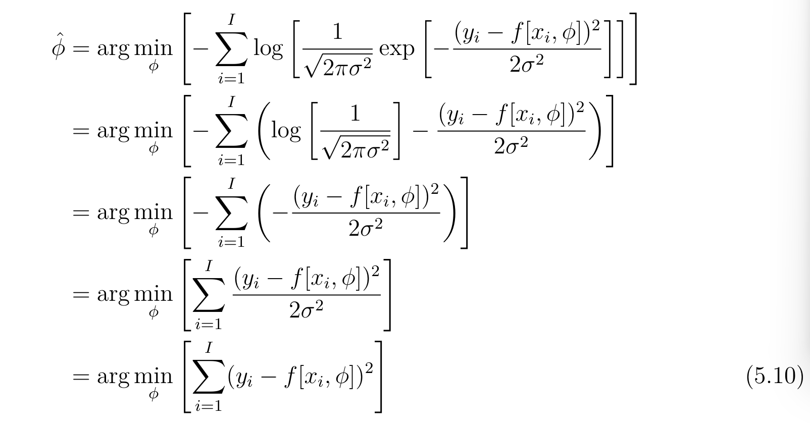

## 2026年3月13日
第55~58页

5.1.2 最大似然准则
最大似然这里，没有看懂，需要后续回头来看。

赶紧像是再输出Y 的基础上取估计输入，让结果最大化。

### 5.2 构建损失函数的步骤

1. 选定一个适合预测结果的y的概率分布
2. 设定机器学习模型
3. 寻找最小化负对数似然损失函数
4. 对新的测试样例x, 返回完整分布的最大值

本章都是再构建基本的概率函数，可以期待一下

### 5.3 单变量回归

5.3.1 最小平方损失函数

经过了一系列的计算，得到了一个最小平方损失函数

基于两个假设：
1. 预测误差(i)是独立的
2. 遵循均值为 正态分布

5.3.2 推断

不是直接预测y，而是预测y的正态分布均值

5.3.3 估计方差

最终的表达式，并不依赖于方差，