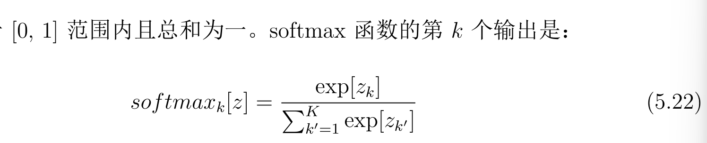

## 2026年3月18日
第63~72页
## 5.5 多类别分类
介绍了 softmax 函数，他接受一个k阶向量，返回一个同阶的结果，公式如5.22

## 5.6 多输出预测
常见的作法是把每个预测视为独立的。

假设每种错误也是独立的。

独立性假设，意味着这两个预测的联合似然是单独似然的乘积。在计算负对数似然时，这些项会转化为加和形式。

## 5.7 交叉熵损失
实际上时与最小化负对数似然时等价的。

交叉熵损失的核心思想时寻找参数thita，以最小化观测数据y的经验分布于模型分布之间的差距，

可以理解为在考虑到另一个分布已知信息后，一个分布中剩余的不确定性量

## 5.8 本章总结
最小化负对数似然，自然结果时，回归的最小二乘法，基于假设y符合正态分布，并且我们正在预测其均值。

#### 今日总结
现在开始的寻找最小化损失函数的方法，其实是有很多没有理解的，一方面是很难，另一方面是没有很多的时间去细细的扣每一个公式的来源与计算方法，也没有进行公式的推导，所以会存在不理解的内容。

对于最小化负对数似然，根本就是仅仅知道这个名字，因为“似然”这个词，就不太理解。

作者在每一章节都留有习题供读者自行证明，现在没有契机证明，等到第二遍阅读时，再想办法证明。