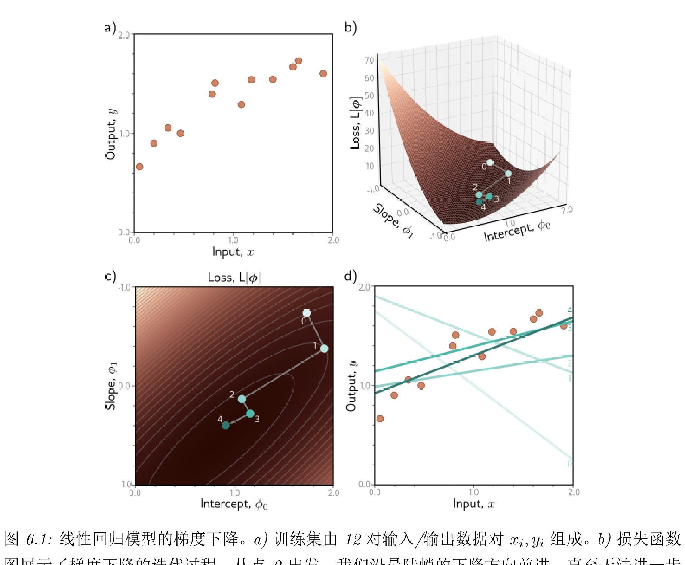

## 2026年3月19日
第63~76页

# 第六章 模型训练
一般原则是，首先选取一组初始参数，重复执行两个步骤：1. 计算损失函数关于参数的导数；2. 根据梯度调整参数，以期减少损失。最终达到其全局最小值

### 6.1 梯度下降
最基本的是梯度下降，从初始参数开始，逐步更新参数 α 确定的是调整的幅度

第一步是计算当前位置上的损失函数的梯度，确定了损失增加的方向；第二步则是向相反方向小幅移动。参数 α 可以固定（就是学习效率）

#### 6.1.1 线性回归示例
就是图6.1的描述

#### 6.1.2 Gabor 模型示例
首先介绍的是线性回归的问题，只能在损失函数是凸性的情况下，才能找到最小值

然后定义了一个简单的模型，公式6.8就是对应的公式，由一个正弦分量和负指数分量组成。