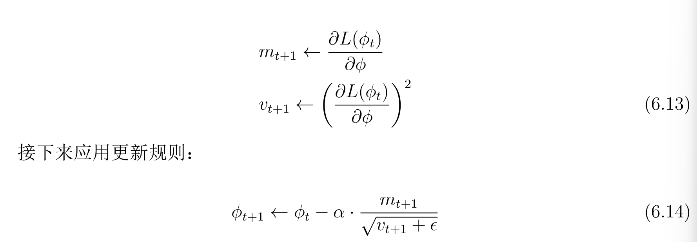

## 2026年3月23日
第81~84页

### 6.3.1Nesterov 加速动量
由图6.8的理解，看起来像是对于当前进度的一次更新，把之前的方向也考虑进来，进行计算的加速。

## 6.4 Adam

当损失函数的表面梯度在一个方向比另一个方向更陡峭时，很难选择一个同时能（i)在两个方向上有效进展且（ii)保持文档的学习率。

方案是：
1. 计算梯度m 和逐点平方梯度v
2. 在应用更新规则

通过其正平方根来标准化梯度，是的最终只剩下每个坐标方向上的符号。算法因此沿每个坐标方向移动固定距离'alpha，方向由下坡方向确定
