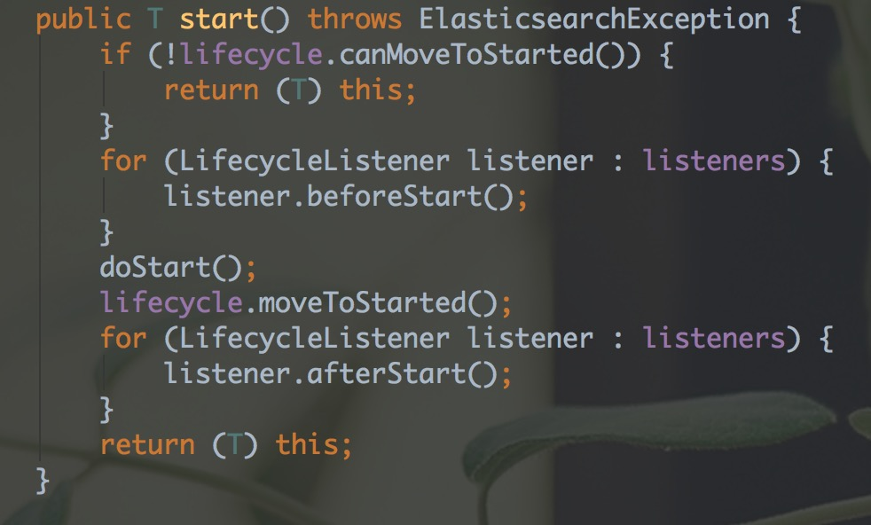

上节，我们学习到了 elasticsearch 启动时加载的配置文件，以及加载顺序。  
本节我们来了解一下 es 在启动时加载了哪些异步任务，本节代码在 `org.elasticsearch.node.internal.InternalNode.start`  

## 如何启动一个异步任务

首先我们看一下任务是如何启动的，举一个例子，`injector.getInstance(IndicesService.class).start();` `IndicesService` 的唯一实现类为 `InternalIndicesService`，且 `InternalIndicesService` 又继承自 `AbstractLifecycleComponent`，同时 `AbstractLifecycleComponent` 有一个start 方法


  
可以发现，其内部实际上调用的是 doStart() 方法，只不过是添加了一些控制，保证不重复启动之类的代码。


各个异步任务，直接摘抄代码，如下，我们暂时做个简单的解释，见注释。后面会针对每个异步任务做详细说明，这也是我们后面阅读源码的详细入口
```
for (Class<? extends LifecycleComponent> plugin : pluginsService.services()) {
    injector.getInstance(plugin).start(); // 启动插件需要的任务
}

// 一些构造方法时，注入对应的变量值，start 方法未做任何事情
injector.getInstance(IndicesService.class).start(); 

// 看代码就知道是控制索引时，使用内存的情况的，防止内存溢出
// start 时，启动了另一个异步任务来控制内存
injector.getInstance(IndexingMemoryController.class).start();

// 节点监控状态，
injector.getInstance(IndicesClusterStateService.class).start();

// 监控 node 过期/掉线，内部启动了 PurgerThread 这个异步任务
injector.getInstance(IndicesTTLService.class).start();

// 看代码启动了另外三个异步任务，后面详细说明
injector.getInstance(RiversManager.class).start();

// 注册和监控节点状态
injector.getInstance(ClusterService.class).start();

// 监听节点状态
injector.getInstance(RoutingService.class).start();

// 这应该是核心任务了，搜索任务
injector.getInstance(SearchService.class).start();

// 监控 jvm 状态
injector.getInstance(MonitorService.class).start();

// 这个看起来是执行搜索
injector.getInstance(RestController.class).start();

// 看起来是多线程的支持
injector.getInstance(TransportService.class).start();
DiscoveryService discoService = injector.getInstance(DiscoveryService.class).start();

// gateway should start after disco, so it can try and recovery 
from gateway on "start"
// 网关任务
injector.getInstance(GatewayService.class).start();

// 支持http
if (settings.getAsBoolean("http.enabled", true)) {
    injector.getInstance(HttpServer.class).start();
}

// 看门狗任务
injector.getInstance(BulkUdpService.class).start();

// 监控资源环境
injector.getInstance(ResourceWatcherService.class).start();

// 保证任务正常的任务 
injector.getInstance(TribeService.class).start();
```

总结
=
今天的内容很少，主要集中在这些个异步任务的说明上，让大家有个总体概念，当然也让我自己有总体概念

最后，希望本文对你有所启发，早日开始elasticSearch 的源码阅读
=
了解更多请关注我的公众号
